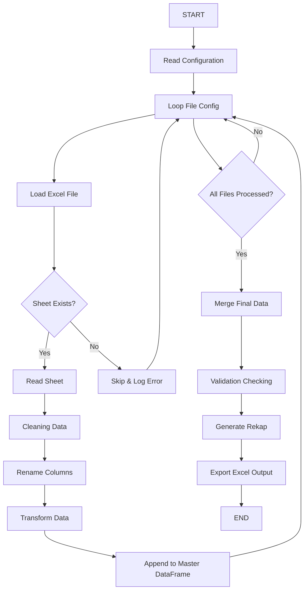

# SOM Monitoring Daily

Automation monitoring dan rekap data SOM menggunakan Python dan Pandas.

---

# Features

- Load multiple Excel files
- Cleaning dan standardisasi data
- Merge seluruh data SOM
- Validasi data
- Generate rekap otomatis
- Export hasil ke Excel

---

# Tech Stack

- Python
- Pandas
- Openpyxl
- NumPy

---

# Project Structure

```text
project/
│
├── data/
├── output/
├── scripts/
├── config/
├── SOM_MONITORING_TERPADU.ipynb
├── requirements.txt
└── README.md
```

---

# Workflow



---

# Installation

```bash
pip install -r requirements.txt
```

---

# Run Project

```bash
jupyter notebook
```

atau

```bash
python main.py
```

---

# Output

- Rekap SOM
- Monitoring report
- Cleaned dataset

---

# Future Improvement

- Add logging
- Config YAML
- Dashboard integration
- Scheduling automation
