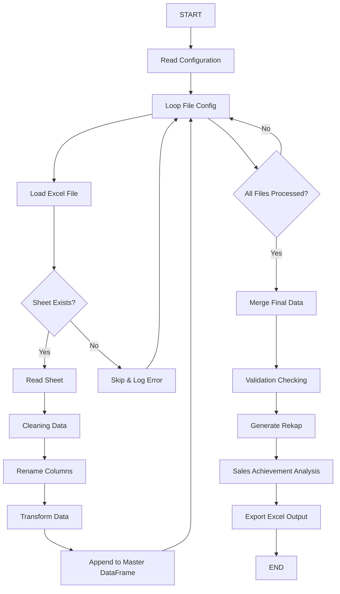

# SOM Monitoring Daily

Automation monitoring dan rekap data SOM menggunakan Python dan Pandas untuk membantu proses analisa dan evaluasi pencapaian sales secara lebih cepat dan akurat.

---

## Business Problem

Sebelum automation ini dibuat, proses monitoring dan analisa data SOM (Sales Order Monitoring) dilakukan secara manual menggunakan **11 template Excel yang berbeda**.

Setiap template memiliki struktur dan format data yang tidak seragam sehingga membutuhkan proses penggabungan data secara manual sebelum dapat digunakan untuk analisa. Proses ini memakan waktu, rentan terhadap human error, serta memperlambat penyampaian informasi kepada tim sales dan management.

### Challenges

- Konsolidasi data dari 11 template membutuhkan waktu yang lama.
- Risiko kesalahan input dan duplikasi data cukup tinggi.
- Monitoring pencapaian sales tidak dapat dilakukan secara cepat.
- Evaluasi performa sales menjadi kurang efektif.
- Identifikasi gap terhadap target penjualan sering terlambat dilakukan.

---

## Business Objective

Project ini dibuat untuk:

- Mengintegrasikan 11 template SOM menjadi satu dataset terpusat.
- Mengotomatisasi proses cleaning dan standardisasi data.
- Mempercepat proses monitoring pencapaian sales.
- Mendukung evaluasi performa sales berdasarkan data yang lebih akurat.
- Membantu management dalam mengidentifikasi pencapaian terhadap target penjualan secara lebih cepat.

---

## Solution

Menggunakan Python dan Pandas untuk:

- Membaca data dari berbagai file Excel.
- Melakukan cleaning dan standardisasi data secara otomatis.
- Menggabungkan seluruh data SOM menjadi satu dataset terpadu.
- Menjalankan validasi data.
- Menghasilkan rekap monitoring secara otomatis.
- Mengekspor hasil akhir ke format Excel untuk kebutuhan analisa dan reporting.

---

## Features

- Load multiple Excel files
- Cleaning dan standardisasi data
- Merge seluruh data SOM
- Validasi data
- Generate rekap otomatis
- Export hasil ke Excel

---

## Tech Stack

- Python
- Pandas
- OpenPyXL
- NumPy

---

## Project Structure

```text
project/
│
├── data/
├── output/
├── scripts/
├── config/
├── SOM_MONITORING_TERPADU.ipynb
├── requirements.txt
└── README.md
```

---

## Workflow



---

## Installation

```bash
pip install -r requirements.txt
```

---

## Run Project

### Jupyter Notebook

```bash
jupyter notebook
```

### Python Script

```bash
python main.py
```

---

## Output

Project menghasilkan beberapa output berikut:

- Rekap SOM terintegrasi
- Monitoring report
- Cleaned dataset
- Sales achievement analysis
- Dataset siap digunakan untuk evaluasi performa sales

---

## Benefits

- Mengurangi pekerjaan manual dalam pengolahan data.
- Mempercepat proses konsolidasi data SOM.
- Meningkatkan akurasi data monitoring.
- Mempermudah evaluasi performa sales.
- Mempercepat identifikasi pencapaian terhadap target penjualan.
- Mendukung pengambilan keputusan berbasis data.

---

## Future Improvement

- Add logging system
- Configuration using YAML
- Dashboard integration (Power BI / Streamlit)
- Scheduling automation
- Email notification report
- Data quality monitoring
- Historical trend analysis
